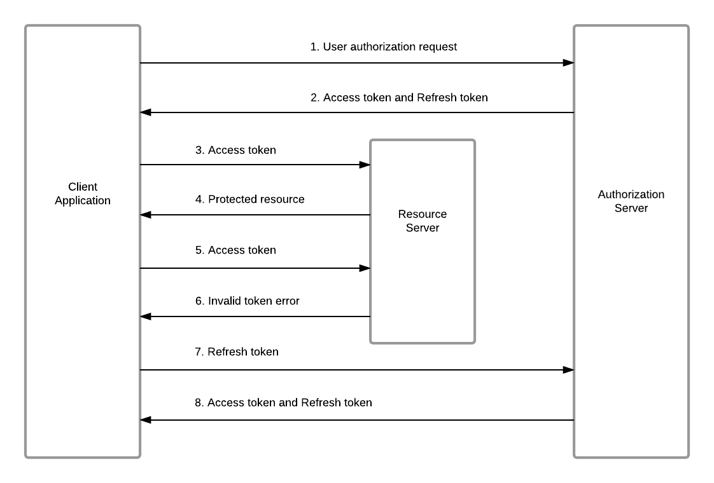

# Spring Boot Security Demo

## Introduction
Repository contains demo project for implementing Authentication process 
using Spring Security.
***
## Technologies
- **Java version** : `17`
- **Spring version** : `3.1.0`
- **Spring Security** : `6.0.0`
- **Postgresql** for storing database tables
- **Lombok** for using annotations
- **JWT** for creating web tokens in authentication
- **spring-boot-starter-mail** for sending emails after user registration
***

## Features
- Implementing full user registration and login process by using **Spring Security** with **JWT** .
- Using **Email verification** to verify user emails during **15 minutes** from the registration .
- Checking for the activation of registered user during login to ensure that user email is correct and valid for using . 
- Providing more secure way to take this application to the next level of security by implementing **refresh token**.
- Using `CustomExceptions` in  [exceptions directory](src%2Fmain%2Fjava%2Fcom%2Fomar%2Fsecurity%2Fexceptions) to handle most edge cases that may happen during authentication process.
### What is Refresh Token ??
A refresh token is a special key that enables a client for an API or service to retrieve new access tokens without requiring the user to perform a complete login. In other words, an application can exchange a valid refresh token for a new access token.
Ideally, access tokens expire after a short period, whereas refresh tokens live for a long time.


***

## Setup
1. add all `mavin` plugins.
2. fill your properties in [application.properties](src%2Fmain%2Fresources%2Fapplication.properties).
3. `spring.datasource.url= [YOUR_DB_URL]`
4. `spring.datasource.username = [DB_USER_NAME]`
5. `spring.datasource.password=[password : *********]`
6. Generate your **256-bit** secret key and replace it into :

    ```token.signing.key=[YOUR_SECRET_KEY_GENERATED]```
7. Create new email for using google SMTP or use your personal gmail by replacing all fields :
    ```
   spring.mail.username=[your_gmail]
    spring.mail.password=[your_password]
   ```
   
